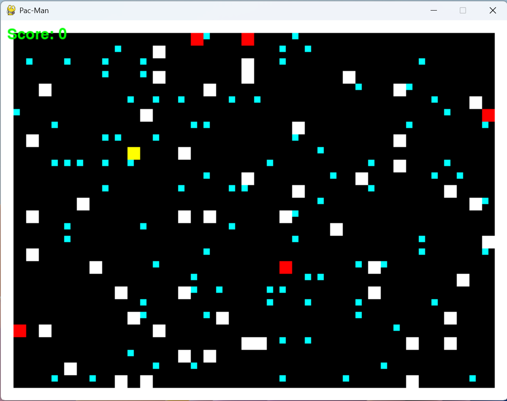

# Pacman.py
A Pacman-inspired game, implemented using the PyGame library.

# Usage
Simply run the game.py file using ``python3 game.py``

# Feedback
I welcome any kind of feedback. Feel free to create a new Issue or start a new Pull Request if you want to add anything!
